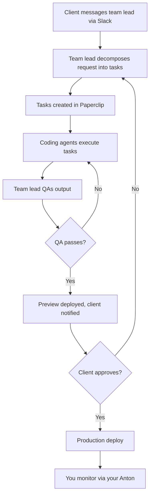

# Managed AI Consulting Team Platform

## Problem Frame

Small businesses need software development, content, and operational help but can't afford full-time hires or manage freelancers effectively. You (DaLab) already run an AI agent (Anton/NanoClaw) for your own work. The opportunity is to offer this as a managed service: each client gets their own AI team that they interact with naturally via Slack or WhatsApp, while you manage the platform, set guardrails, and handle escalations.

**V1 goal:** Deploy 2 tenants (DaLab + 1 existing test client) to validate the full loop — technical integration works, clients get real value, and you can operate it without drowning.

**Transparency model:** Hybrid. Clients know the team is AI-powered but interact naturally (Slack conversations, not "prompt engineering"). The value prop is "managed AI team" not "invisible humans."

*Note: Flowchart shows the Tier 2+ approval path. At Tier 1, the platform admin approves instead of the client.*

## Requirements

**Team Lead Agent (per tenant)**

- R1. Each tenant gets a team lead agent running as a NanoClaw instance that receives client messages via Slack or WhatsApp and acts as single point of contact
- R2. Team lead decomposes client requests into discrete tasks and creates them in Paperclip (the tenant's company workspace)
- R3. Team lead reviews automated QA output (build results, screenshots). At Tier 1, the team lead escalates QA results to the platform admin for final approval. At Tier 2+, the team lead makes the final pass/fail decision before presenting to client
- R4. Team lead escalates to you (the platform admin) via your Anton's channel when encountering unknown requests, failures, or decisions that exceed its guardrail tier
- R5. Team lead deploys previews and (with approval per guardrail tier — see R21) production deploys
- R6. Team lead NanoClaw process runs as a systemd service with automatic restart on failure. Your Anton is notified of restarts. Note: systemd service templates and provisioning infrastructure (cloud-init, Pulumi stacks) do not yet exist in this repo and must be created

**Engineer Agent (spawned per task)**

- R7. Paperclip assigns tasks to coding agents; agents execute within NanoClaw's container runtime (credential proxy, mount isolation, resource limits). The execution backend is NanoClaw's container-runner, not Paperclip's direct spawning
- R8. Engineer agents can extract designs from Figma files (structure, styles, images) to build components matching design specs
- R9. Engineer agents have access only to their assigned tenant's repos and credentials — no cross-tenant access. Each tenant gets its own deploy keys (not copied from admin)

**Paperclip Integration**

- R10. NanoClaw integrates with Paperclip via MCP tools so the team lead can create projects, create/assign tasks, monitor progress, and read agent output
- R11. Each tenant's NanoClaw authenticates to Paperclip with a tenant-scoped API key that restricts access to that tenant's Paperclip company only
- R12. Paperclip runs as a shared service (single instance, multi-tenant) alongside the NanoClaw instances
- R13. QA automation runs within Paperclip's task pipeline. Build checks and responsive screenshots are required for V1; visual comparison against Figma is a stretch goal (see R25)

**Multi-Tenant Isolation**

- R14. Each tenant runs as a separate Linux user with its own NanoClaw process, credentials (.env), message store, and agent containers
- R15. Each tenant's NanoClaw runs its credential proxy on a distinct port to avoid collisions. Containers reference their tenant's proxy only
- R16. Tenants are isolated at every layer: filesystem (Linux users), credentials (separate .env with per-tenant keys), process (separate NanoClaw), compute (Docker containers), data (separate Paperclip companies with scoped API keys), network (Cloudflare subdomain routing)
- R17. Your personal Anton instance monitors all tenants via Paperclip's API (using an admin-scoped API key) and receives alerts on failures or escalations. This is an intentional cross-tenant access path, distinct from tenant-to-tenant isolation

**Credential Management**

- R18. Each tenant gets its own: Anthropic API key (or sub-key), Slack bot token, GitHub deploy keys (per repo, not shared), Paperclip API key (scoped to their company), and Vercel token
- R19. Credentials are generated per-tenant during provisioning, stored in the tenant's .env file (readable only by that tenant's Linux user). No credentials are copied from the admin user
- R20. Credential rotation and revocation procedures are documented as part of tenant offboarding (post-V1 but the per-tenant key architecture must support it)

**Guardrail Tiers**

- R21. Three guardrail tiers control agent autonomy per tenant: Tier 1 (new client — you approve everything), Tier 2 (established — client approves production), Tier 3 (trusted — autonomous with notifications)
- R22. Tier is stored in the tenant's brain template configuration and read by the team lead agent at each approval decision point. The team lead enforces the tier — it is a behavioral constraint in V1, not middleware. Risk: if the LLM ignores the tier config, unauthorized deploys could occur. A technical deploy gate (e.g., CI check or deploy hook requiring approval token) can be added post-V1 if behavioral enforcement proves unreliable
- R23. All tenants start at Tier 1. Promotion is manual based on trust and track record
- R24. Budget caps per tenant per month. Paperclip's budget enforcement must be verified during the validation spike. If Paperclip lacks per-company budget caps, V1 falls back to manual spend monitoring by the platform admin at Tier 1

**QA and Deploy Pipeline**

- R25. QA runs within Paperclip's task pipeline: build check and responsive screenshots are required for V1. Lighthouse audit and Figma visual comparison are stretch goals included if Paperclip supports them natively or they can be added as task steps with low effort
- R26. Preview deploys are automatic; production deploys require approval per guardrail tier (R21)
- R27. Deploy targets are per-tenant (Vercel project ID, domain)

**Tenant Onboarding**

- R28. Tenant provisioning has two phases: (a) automated infrastructure (Linux user, NanoClaw clone, credential generation, systemd service template creation, credential proxy port + web channel port assignment, Cloudflare subdomain) via a new provision-tenant.sh script (existing script copies admin deploy keys and must be rewritten to generate per-tenant keys per R9/R19), and (b) interactive setup (Slack OAuth, GitHub deploy key registration, Paperclip company creation via API, brain template customization)
- R29. Brain templates are customized per client with: brand name/voice, tech stack, deploy target, guardrail tier

## Success Criteria

- **Technical:** A test client sends a real request via Slack ("build a landing page from this Figma"), and the full loop completes: decomposition, Figma extraction, build, QA, preview, approval, production deploy
- **Isolation:** Test client's agent cannot access DaLab's files, credentials, or Paperclip data
- **Monitoring:** Your Anton monitors both tenants and alerts you on failures or restarts
- **Client experience:** The test client finds the interaction natural and the output useful (qualitative feedback after 3+ completed requests)
- **Operational:** After 2 weeks of operation with both tenants active, you spend less than 2 hours/week on platform management (excluding client work itself)

## Scope Boundaries

- **V1 only:** Team lead + engineer roles. Content writer, ops assistant, bookkeeper are post-v1
- **V1 only:** 2 tenants on a single OCI VM. Multi-VM scaling is post-v1
- **Not in scope:** Pricing model, billing, client-facing dashboard, self-service onboarding
- **Not in scope:** QuickBooks/Xero, Google Workspace, or CRM integrations
- **Not in scope:** Automated tenant promotion between guardrail tiers
- **Not in scope:** Comprehensive security hardening of all ENTERPRISE_AUDIT findings — but credential proxy port isolation (R15) and per-tenant deploy keys (R9) must be addressed for multi-tenant safety

## Key Decisions

- **Paperclip as back-office:** Use Paperclip (github.com/paperclipai/paperclip) for task management, agent orchestration, budget enforcement, QA pipeline, and audit trails. Rationale: mature OSS project with multi-tenancy, budget control, and Claude Code agent support. This decision is contingent on a validation spike (see Dependencies) confirming Paperclip's API and adapter meet requirements
- **NanoClaw as execution backend:** Paperclip orchestrates tasks; NanoClaw's container-runner executes them. This preserves NanoClaw's credential proxy, mount isolation, and resource limits. Paperclip does not directly spawn processes
- **NanoClaw per tenant, not shared:** Each tenant gets their own NanoClaw instance. Rationale: isolates credentials, message history, and agent memory cleanly using existing architecture. Simpler than adding multi-tenancy to NanoClaw itself
- **Hybrid transparency:** Clients know it's AI but interact naturally. Rationale: avoids ethical risk of deception while keeping the UX simple
- **Figma in v1:** Design-to-code is the core engineering value prop — testing without it doesn't validate the real workflow. If Figma MCP proves infeasible during planning, the fallback is manual Figma-to-description by the team lead (extract key specs from Figma URL and describe to engineer in text)
- **Single VM for v1:** Both tenants on one OCI VM. Linux user isolation + Docker + Paperclip multi-tenancy is sufficient at this scale

## Dependencies / Assumptions

- **Paperclip validation spike (prerequisite):** Before planning, deploy Paperclip locally or on the OCI VM and verify: (a) API supports task CRUD, agent assignment, and status polling, (b) `claude_local` adapter can be configured to invoke NanoClaw's container-runner as the execution backend, (c) budget enforcement exists and can be configured per-company, (d) company-scoped API keys provide tenant isolation. If any of these fail, the fallback is to build lightweight task dispatch directly in NanoClaw for V1 and revisit Paperclip later
- Paperclip, PostgreSQL, and nanoclaw-agent Docker images are available for ARM (aarch64) — the OCI VM is ARM-only. Verify container/build.sh base image and native dependencies are ARM-compatible
- The OCI VM (4 ARM cores, 24GB RAM) must support Paperclip + PostgreSQL + 2 NanoClaw instances + concurrent agent containers. Agent containers should have memory limits set (e.g., 4GB each) to prevent resource exhaustion. Sizing should be validated during the Paperclip spike
- Test client has a Slack workspace and GitHub org ready to connect
- Test client has Figma designs available for the validation test

## Outstanding Questions

### Resolve Before Planning

- [Affects R10-R13][Needs research] Paperclip validation spike: deploy Paperclip, test API, adapter, budget enforcement, and tenant-scoped API keys. Results determine whether to proceed with Paperclip or fall back to NanoClaw-only V1

### Deferred to Planning

- [Affects R8][Technical] Best approach for Figma MCP — build custom MCP server, use an existing Figma MCP package, or use Figma's REST API directly from agent skills?
- [Affects R25][Technical] How to implement visual comparison between Figma source and built output — pixel diff, LLM-based comparison, or manual review?
- [Affects R28][Technical] How much of tenant provisioning can be automated vs. requires interactive steps (Slack OAuth, GitHub deploy key setup)?
- [Affects R12][Technical] Paperclip deployment configuration — resource allocation, PostgreSQL setup, backup strategy for the shared instance
- [Affects R17][Technical] How does your Anton monitor other tenants — poll Paperclip API, receive webhooks, or watch NanoClaw logs?
- [Affects R7][Technical] How does Paperclip invoke NanoClaw's container-runner? NanoClaw has no HTTP API for triggering runs — only channel messages and IPC file writes. An integration surface (HTTP endpoint, IPC bridge, or CLI wrapper) must be designed

## Next Steps

→ Run Paperclip validation spike to resolve the blocking question, then `/ce:plan` for structured implementation planning.
